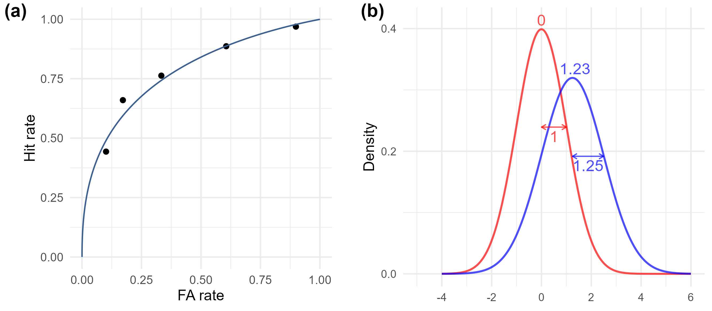
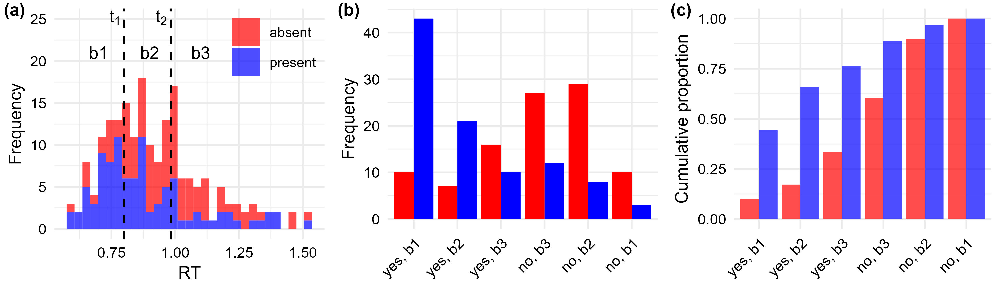

<!-- README.md is generated from README.Rmd. Please edit that file -->

# RT Type-1 ROC

This repository provides the `R` implementation of the analyses
presented in “Correcting for Unequal Variance in Signal Detection Models
Using Response Time,” available at
<https://doi.org/10.1016/j.isci.2026.114998>.  
For a `Python` implementation, see <https://github.com/trevcaru/rt-da>.

## Unequal-variance signal detection theory analysis

The code `uvsdt.R` defines the function `fit_uvsdt_mle()` for model
fitting.  
`nr_s1` and `nr_s2` are response frequency vectors for S1
(target-absent) and S2 (target-present) trials, ordered from “fastest-RT
(or highest-confidence) Yes” to “fastest-RT (or highest-confidence) No”
responses (see Figure 2b below).  
`add_constant = TRUE` adds a small value to the response frequency
vectors for estimation stability (default value is TRUE).

``` r
nr_s1 <- c(10,  7, 16, 27, 29, 10)
nr_s2 <- c(43, 21, 10, 12,  8,  3)

source("uvsdt.R")
f1 <- fit_uvsdt_mle(nr_s1, nr_s2, add_constant = TRUE)
f1
#>         mu    sigma       da    cri.X1     cri.X2    cri.X3    cri.X4   cri.X5
#> 1 1.231417 1.252275 1.086691 -1.234045 -0.2754573 0.3930064 0.8424681 1.381982
#>        logL
#> 1 -315.8781
```

<p align="center">
<br> <strong>Figure 1</strong>
</p>

## RT-based type-1 ROC construction

Our approach for constructing type-1 ROC based on RT is explained using
a three-level RT bin example. First, RTs are divided into three
equal-sized bins, with stimulus class (absent/present) and response
(yes/no) collapsed. Figure 2a illustrates this process, where
t<sub>1</sub> and t<sub>2</sub> represent the cutoff thresholds defining
the RT tertiles, and b1, b2, and b3 correspond to the fastest,
second-fastest, and slowest RT bins, respectively. Trials for each
stimulus class are thus characterized by an assigned response (yes/no)
and an RT bin (three levels), classified in six response categories.
Figure 2b shows the response frequency of these categories, arranged
from left to right to indicate decreasing support for “yes” judgment
(e.g., “no” responses in the fastest RT bin represent the weakest
indication of “yes” judgment). In Figure 2c, cumulative response
proportions are calculated for each stimulus class sequentially from
left to right, which correspond to hit and FA rates in type-1 ROC space
(see Figure 1a).

<p align="center">
<br> <strong>Figure
2</strong>
</p>

## Files

The `perception` folder includes data and code for the main manuscript,
where `analysis_perception.R` implements all the analyses reported.  
The `memory` folder includes data and code for the supplementary
material, where `analysis_memory.R` implements the relevant analyses.
